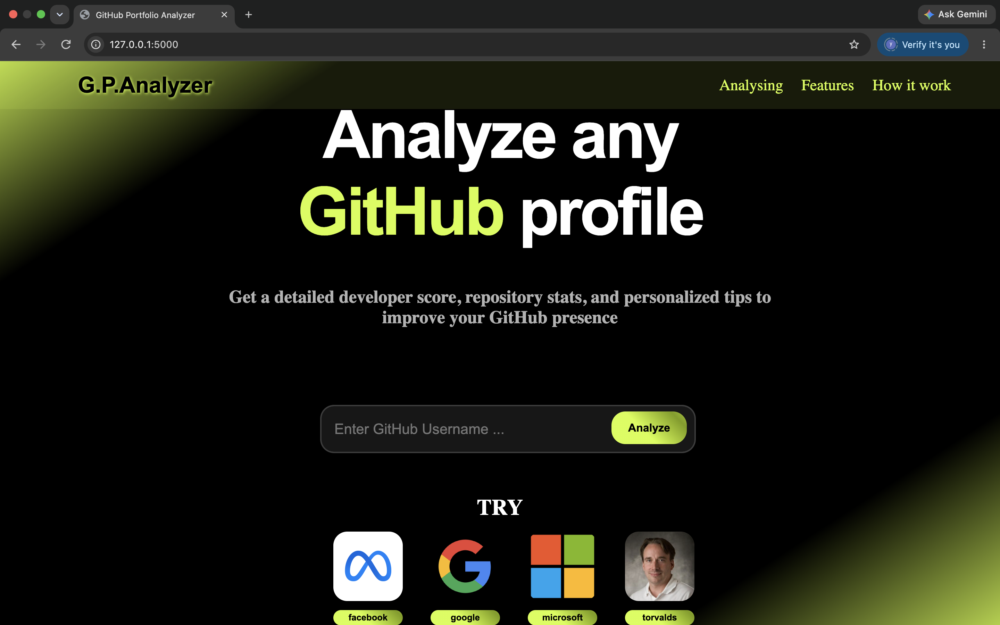
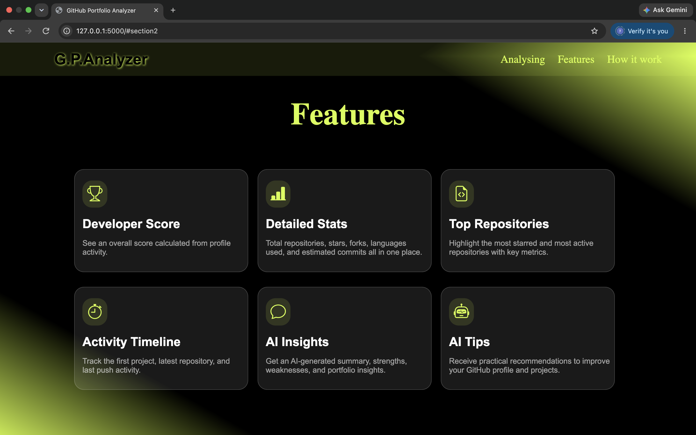
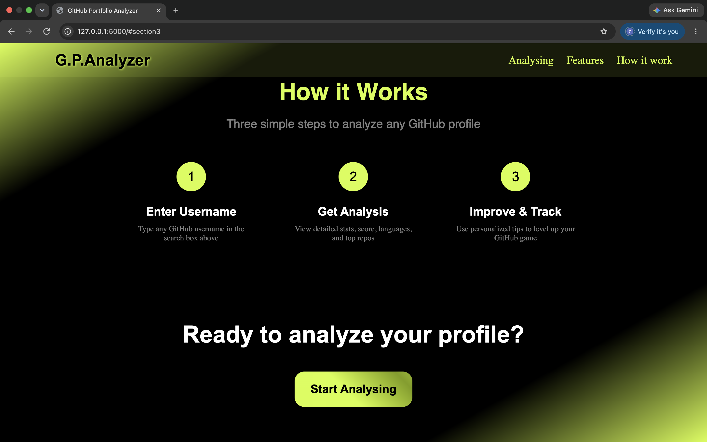
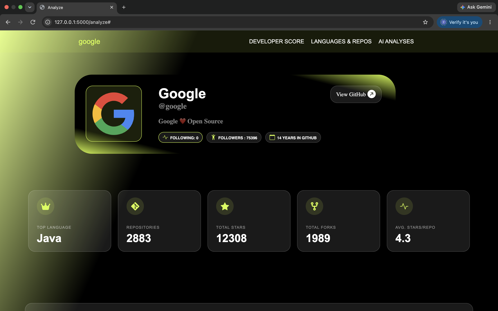
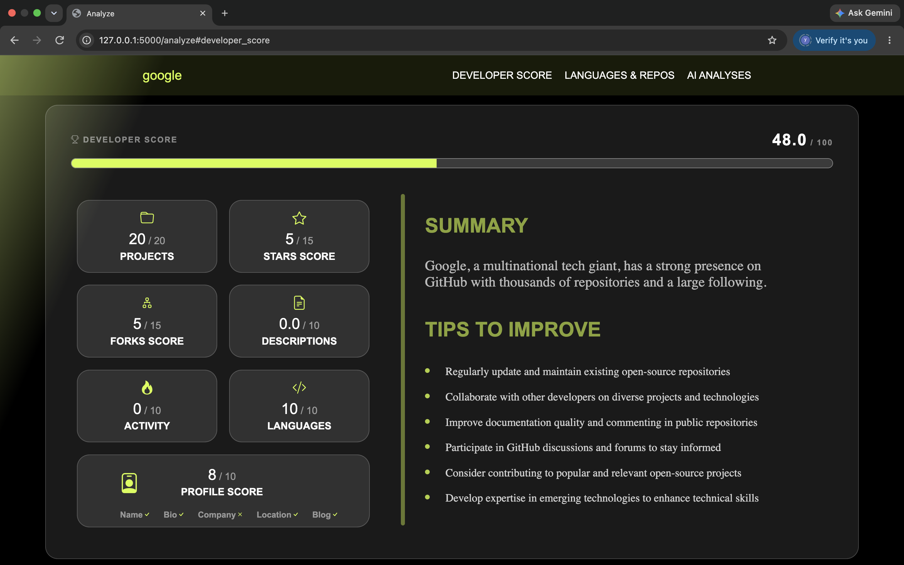
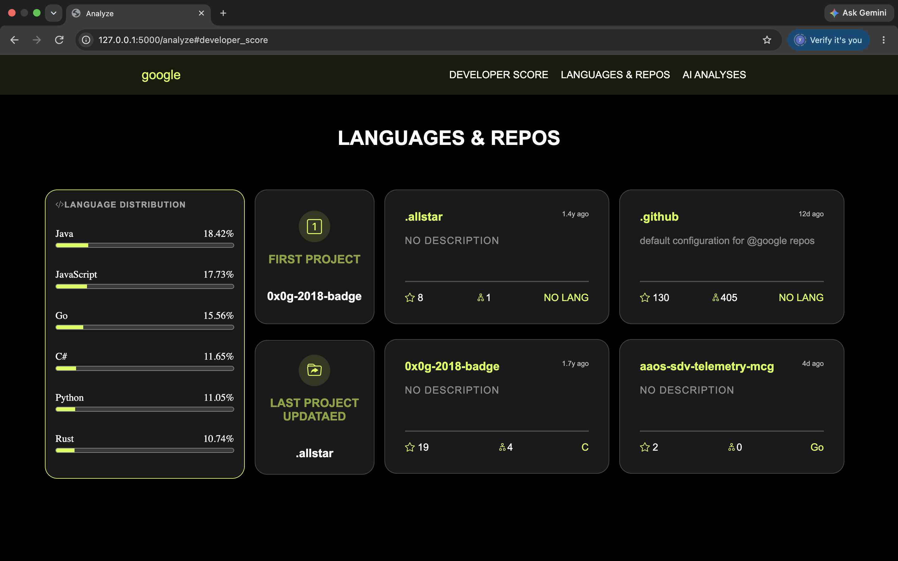
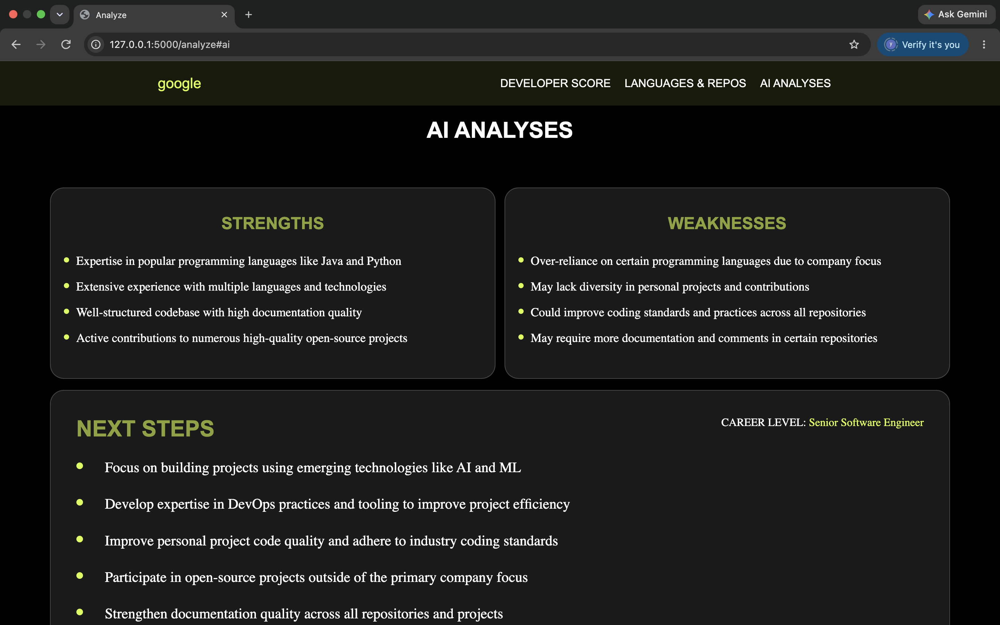

# ARABIC 
## GitHub تحليل حساب
مشروعي GitHub portfolio analyzer فكرته هو موقع يستخدم الapis الخاصة ب جت هب لجلب بعض البيانات عن حساب المستخدم من اسمه وهنا يأتي الفكره الموقع بياخد هذه البيانات القليله ويبني عليها تحليل كامل الحساب

### امثله علي البيانات التي يحسبها
- اكتر اللغات استخداما حساب دقيق في الباك اند
- وعدد المتابعين
- عمر الحساب
- اسكور المطور وهذا يحلل الكثير من البيانات للوصول لاكبر دقه
- ويعطي أيضا نقاط القوه والضعف
- وخطواط قادمه لتحسين حسابك ونفسك في البرمجه
- وغيرها الكثير مش هعرف اذكرها كلها

### ماذا تعلمت والتحديات الي واجهتني
- تطورت جدا بفلاسك
- تعلمت استخدام Apis باحتراف وخاصه groq
- تعلمت كيفيه كتابه prompt  صحيح ل AI
- وكمان استخدمت رياضيات لحساب بعض الأجزاء  وكلتا عارفين الرياضيات قد ايه سهله 😅
##### التحديات
- المشاكل الدائمه في الapi
- وكبر الكود وتعقيده
- واكبر مشكله واجهتني هي رفع المشروع علي pythonanywhere 
تقريبا خد مني ٣ ساعات كلها مشاكل
- وغيرها بس انا ناسي دلوقتي

### لينك التجربه
 اللينك :  https://youssef388.pythonanywhere.com/

# ENGLISH 
## GitHub Account Analysis

My project, **GitHub Portfolio Analyzer**, is a website that uses the GitHub APIs to fetch data about a user's account using only their username. This is where the idea comes in: the website takes this limited data and builds a complete analysis of the account.

### Examples of the data it analyzes
- Most used programming languages with accurate backend calculations.
- Number of followers.
- Account age.
- Developer score, which analyzes a lot of data to achieve the highest possible accuracy.
- It also provides strengths and weaknesses.
- Next steps to improve both your GitHub profile and your programming skills.
- And much more that I can't mention all of.

### What I learned and the challenges I faced
- I improved a lot with Flask.
- I learned how to use APIs professionally, especially Groq.
- I learned how to write proper prompts for AI.
- I also used some math to calculate certain parts, and we all know how "easy" math is 😅.

##### Challenges
- Constant API issues.
- The code becoming larger and more complex.
- The biggest challenge I faced was deploying the project to PythonAnywhere.
  It took me almost 3 hours because of all the problems.
- And many others, but I can't remember them right now.

### Demo Link
Link: https://youssef388.pythonanywhere.com/

# IMAGES 

#### home page 

#### analyses page 

